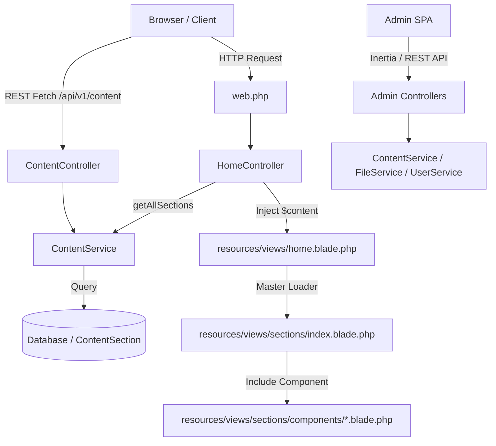

# Medians Chat - Interactive AI Portfolio & CMS


> **Documentation Note:** For the complete interactive HTML documentation page designed for CodeCanyon package deployment, open **[`documentation/index.html`](file:///c:/xampp/htdocs/medians_chat/documentation/index.html)** in any web browser.

---

## 🚀 Overview

**Medians Chat** is a modern, dynamic Laravel-backed interactive portfolio and browsing in AI/Chat mode CMS application. The platform features a dynamic CMS architecture where portfolio content sections (`intro`, `about`, `skills`, `projects`, `clients`, `contact`, `hobbies`, `age`, `cv`, `education`, `experience`, `awards`, etc.) are managed via an **Inertia.js + React 19 Admin SPA** and rendered seamlessly on the frontend via Blade templates and REST API endpoints.

### Key System Capabilities
- **Interactive Chat & Flow Engine**: Visitors explore the portfolio via conversational prompt flows, keyword trigger matching, or quick UI action chips.
- **Inertia.js + React 19 Admin Portal**: Ultra-fast single-page admin application powered by React 19, TypeScript, TanStack Query, and Lucide React icons.
- **User Messages & Prompt Analytics**: Real-time log of interactive user prompts, frequency metrics, popular prompt charts, and soft-delete/restore operations.
- **Form Messages Inbox**: Dedicated contact submission manager with status badge filtering (New, Pending, Resolved), detail modals, and message management.
- **Media Library Manager**: Centralized file uploader featuring drag-and-drop uploads, security file validation, MIME protection, and one-click URL copying for CMS inputs.
- **Home Navigation Builder**: Custom menu items manager to customize site navigation links and target flow actions.
- **User Management**: Admin accounts management with password resets, security roles, and active account toggles.
- **System & AI Settings**: Global application branding, contact details, OpenAI API key configuration, custom AI prompt fallbacks, and default theme skins.
- **Web Speech API & Audio Synthesis**: Browser voice recognition input and Text-to-Speech (TTS) audio synthesis engine.
- **Multi-Theme Skin Switcher**: Dynamic CSS theme switcher widget with customizable color palettes.

---

## 🏗 Architecture Overview

The application follows a clean **Laravel MVC Service-Layer Architecture** paired with an **Inertia.js React SPA**:



### Key Architectural Concepts
1. **Dynamic Content Engine**: All section data are stored dynamically in the `content_sections` database table (`section_key` primary key and native JSON `data` attribute cast).
2. **Server-Side Blade Component Engine**: `HomeController` passes the `$content` key-value array to `home.blade.php`, which delegates section rendering to `resources/views/sections/index.blade.php` and specialized subcomponents (`intro_screen`, `skills`, `gallery`, `blocks`, `stats`, `clients`, `direct_contact`, `social_links`, `options_list`, etc.).
3. **Interactive Flow Controls**: Frontend scripts (`app.js` and `scroll-flow.js`) parse HTML data attributes (`data-flow-id`, `data-triggers`, `data-action`, `data-link`) to trigger smooth visual transitions, modal popups, and conversational AI responses.

---

## 📋 System Requirements

- **PHP:** `^8.2.4` (PHP 8.2 or 8.4 recommended)
- **PHP Extensions:** `OpenSSL`, `PDO`, `PDO_MySQL`, `Mbstring`, `Tokenizer`, `XML`, `Ctype`, `JSON`, `BCMath`, `Fileinfo`, `Zip`, `cURL`
- **Database:** MySQL 8.0+ / MariaDB 10.4+
- **Node.js:** 18.x or 20.x + npm 9+
- **Composer:** 2.x
- **Web Server:** Apache (with `mod_rewrite` enabled) or Nginx

---

## 🛠 Local Development & Setup

1. **Clone/Extract Repository & Install Dependencies**:
   ```bash
   composer install
   npm install
   ```

2. **Configure Environment**:
   ```bash
   cp .env.example .env
   php artisan key:generate
   ```
   Set your database and OpenAI credentials in `.env`:
   ```env
   APP_NAME="Medians Chat"
   APP_URL=http://localhost:8000

   DB_CONNECTION=mysql
   DB_HOST=127.0.0.1
   DB_PORT=3306
   DB_DATABASE=medians_chat
   DB_USERNAME=root
   DB_PASSWORD=

   ```

3. **Database Migration & Seeding**:
   ```bash
   php artisan migrate --seed
   php artisan storage:link
   ```

4. **Compile Assets & Run Servers**:
   ```bash
   # Terminal 1: Compile Vite Assets
   npm run dev

   # Terminal 2: Run Application Server
   php artisan serve
   ```

---

## 🔑 Default Admin Credentials

After running `php artisan db:seed`, log in at `/login` or `/admin`:

- **Login URL:** `http://127.0.0.1:8000/login`
- **Email:** `admin@domain.com`
- **Password:** `Admin123`

---

## 📁 Directory & File Structure

```
medians_chat/
├── app/
│   ├── Http/
│   │   ├── Controllers/          # Controllers (Home, Content, UserMessage, FormMessage, Files, UserController, SettingController, etc.)
│   │   └── Requests/             # Form validation classes (SubmitFormMessageRequest, StoreUserRequest, etc.)
│   ├── Models/                   # Eloquent Data Models (ContentSection, UserMessage, FormMessage, User, Setting, HomeMenu, File, etc.)
│   └── Services/                 # Business logic & Service layer (ContentService, FileService)Documentation Page for CodeCanyon
├── public/
│   ├── assets/                   # CSS stylesheets, JS scripts (app.js, scroll-flow.js), audio, theme skins
│   └── storage/                  # Public storage symbolic link
├── resources/
│   ├── css/                      # Stylesheet source files
│   ├── js/src/                   # Inertia + React 19 Admin SPA source
│   │   ├── api/                  # API client modules (formMessagesApi, userMessagesApi, filesApi, usersApi, settingsApi, etc.)
│   │   ├── components/           # Reusable UI components (Sidebar, Topbar, Modals, Cards, Badges)
│   │   └── pages/admin/          # React Admin SPA Page Modules
│   │       ├── auth/             # Admin Login Page
│   │       ├── content/          # CMS Content Sections Manager & Editors
│   │       ├── form_messages/    # Form Messages Inbox Page & CSS
│   │       ├── media/            # Media Library Page
│   │       ├── menu/             # Home Navigation Menu Builder Page
│   │       ├── settings/         # General Settings Page
│   │       ├── user_messages/    # User Messages Log & Analytics Page
│   │       ├── users/            # User & Admin Management Page
│   │       └── DashboardPage.tsx # Main Admin Analytics Dashboard
│   └── views/                    # Blade View Templates
│       ├── layout/               # Master layout wrapper components
│       ├── sections/             # Portfolio & Chat Content Sections
│       │   ├── components/       # Component partials (intro_screen, skills, gallery, stats, direct_contact, etc.)
│       │   └── index.html.php    # Master dynamic section loader engine
│       └── home.blade.php        # Main homepage view orchestrator
└── routes/
    └── web.php                   # Web, Inertia, and REST API (/api/v1/...) route definitions
```

---

## 🔌 REST API Endpoints Overview

All REST API endpoints are prefixed with `/api/v1`.

### 🌐 Public Endpoints
| Method | Endpoint Route | Description |
| :--- | :--- | :--- |
| `GET` | `/api/v1/content` | Fetch all CMS content sections mapped by `section_key` |
| `GET` | `/api/v1/content/{key}` | Fetch specific section JSON object (e.g. `about`, `intro`) |
| `GET` | `/api/v1/home-menus` | Fetch all active homepage navigation menu items |
| `GET` | `/api/v1/active-menu` | Fetch active menu configuration |
| `GET` | `/api/v1/home-menus/{id}` | Fetch specific menu item details |
| `POST` | `/api/v1/send-prompt` | Submit visitor interactive chat prompt |
| `POST` | `/api/v1/send-message` | Submit visitor contact form message |
| `POST` | `/api/v1/auth/login` | Authenticate admin user and issue session |

### 🔒 Admin Authenticated Endpoints (`middleware: auth`)

#### Dashboard & Analytics
| Method | Endpoint Route | Description |
| :--- | :--- | :--- |
| `GET` | `/api/v1/dashboard/stats` | Fetch system metrics, prompt analytics, and recent activity |
| `GET` | `/api/v1/admin-menu` | Fetch admin sidebar navigation items |

#### CMS Content Management
| Method | Endpoint Route | Description |
| :--- | :--- | :--- |
| `PUT` | `/api/v1/content/{key}` | Bulk update JSON data payload for a specific CMS section key |

#### User Messages & Prompt Analytics
| Method | Endpoint Route | Description |
| :--- | :--- | :--- |
| `GET` | `/api/v1/user-messages` | List visitor chat prompts with pagination and search |
| `GET` | `/api/v1/user-messages/popular` | Fetch top/most popular visitor chat prompts |
| `POST` | `/api/v1/user-messages` | Store new user message record |
| `GET` | `/api/v1/user-messages/{id}` | Show specific user message record |
| `PUT` | `/api/v1/user-messages/{id}` | Update user message record |
| `DELETE` | `/api/v1/user-messages/{id}` | Soft-delete user message record |
| `POST` | `/api/v1/user-messages/{id}/restore` | Restore soft-deleted user message |
| `DELETE` | `/api/v1/user-messages/{id}/force` | Permanently delete user message record |

#### Form Messages (Contact Inbox)
| Method | Endpoint Route | Description |
| :--- | :--- | :--- |
| `GET` | `/api/v1/form-messages` | List contact form submissions with status filters |
| `POST` | `/api/v1/form-messages` | Submit new form message entry |
| `PATCH` | `/api/v1/form-messages/{id}/status` | Update message status (`new`, `pending`, `resolved`) |
| `PUT` | `/api/v1/form-messages/{id}` | Update form message details |
| `DELETE` | `/api/v1/form-messages/{id}` | Delete form message entry |

#### Media Library & Files
| Method | Endpoint Route | Description |
| :--- | :--- | :--- |
| `GET` | `/api/v1/files` | List uploaded files in media library |
| `POST` | `/api/v1/files/upload` | Upload media file with MIME security validation |
| `DELETE` | `/api/v1/files` | Delete file from storage and database |

#### User Management
| Method | Endpoint Route | Description |
| :--- | :--- | :--- |
| `GET` | `/api/v1/users` | List admin users with pagination and search |
| `POST` | `/api/v1/users` | Create new admin user account |
| `GET` | `/api/v1/users/{id}` | Show user profile details |
| `PUT` | `/api/v1/users/{id}` | Update user name, email, role, or status |
| `PUT` | `/api/v1/users/{id}/password` | Reset user password |
| `DELETE` | `/api/v1/users/{id}` | Delete user account |

#### Home Navigation Menu
| Method | Endpoint Route | Description |
| :--- | :--- | :--- |
| `POST` | `/api/v1/home-menus` | Create new navigation menu item |
| `PUT` | `/api/v1/home-menus/{id}` | Update navigation menu item |
| `DELETE` | `/api/v1/home-menus/{id}` | Delete navigation menu item |

#### System Settings
| Method | Endpoint Route | Description |
| :--- | :--- | :--- |
| `GET` | `/api/v1/settings` | List all system settings grouped by category |
| `GET` | `/api/v1/settings/groups` | List available settings groups |
| `GET` | `/api/v1/settings/groups/{group}` | Fetch settings for a specific group (e.g. `general`, `seo`) |
| `PUT` | `/api/v1/settings` | Bulk update settings key-value object |
| `PUT` | `/api/v1/settings/{key}` | Update individual setting key |

#### Admin Authentication & Profile
| Method | Endpoint Route | Description |
| :--- | :--- | :--- |
| `GET` | `/api/v1/auth/me` | Fetch authenticated user profile info |
| `PUT` | `/api/v1/auth/password` | Change current user password |
| `POST` | `/api/v1/auth/logout` | Terminate admin session |

---

## 📞 Support & Package Export

For Envato / CodeCanyon support and submission details:
- **Interactive Documentation Page**: The `documentation/index.html` file provides a complete, standalone documentation view suitable for Envato distribution.
- **Support Email**: [support@medians.tech](mailto:support@medians.tech)
